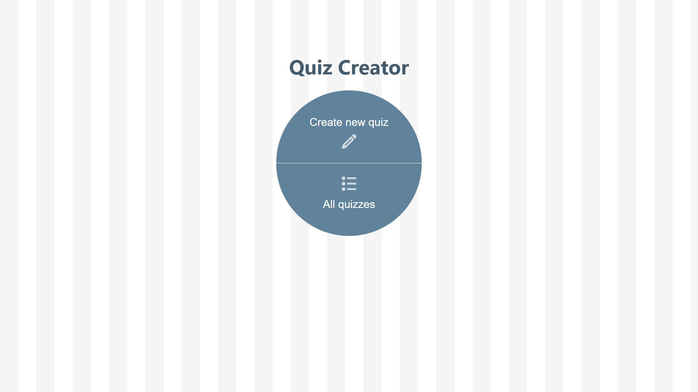
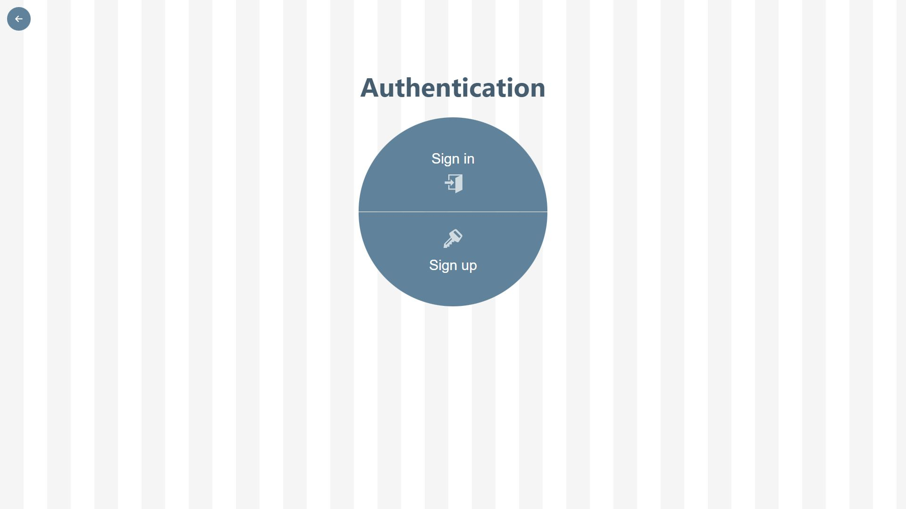
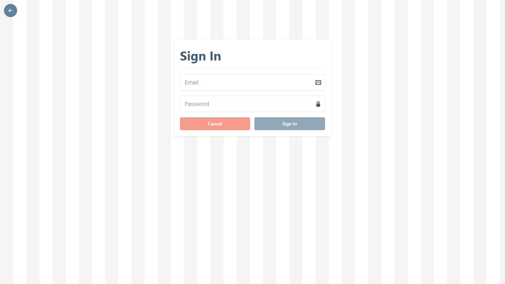
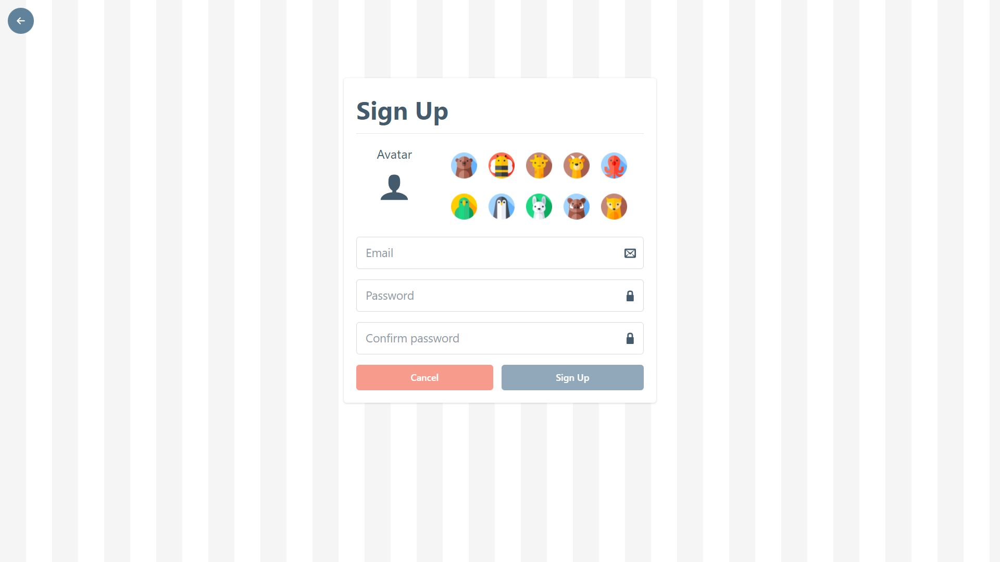
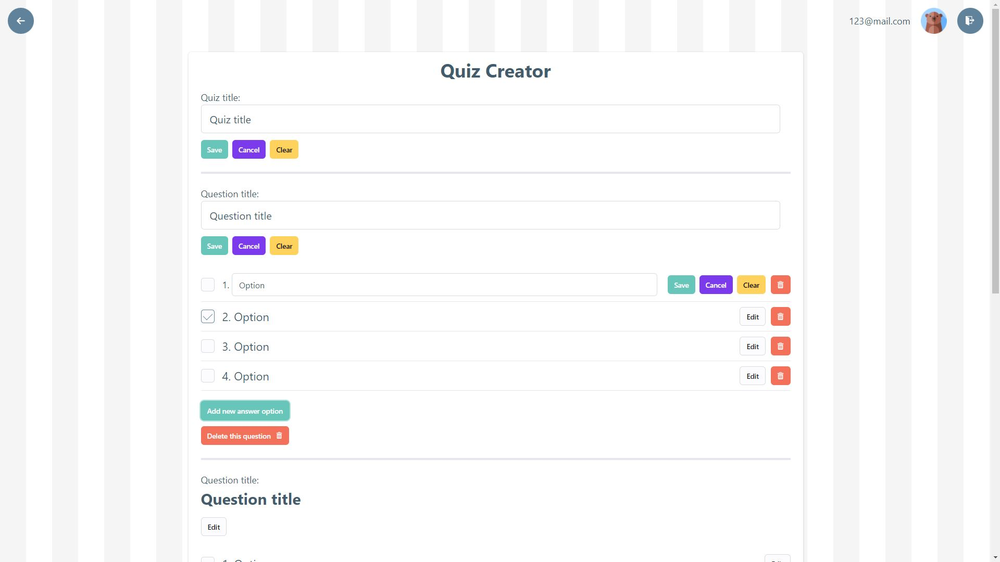
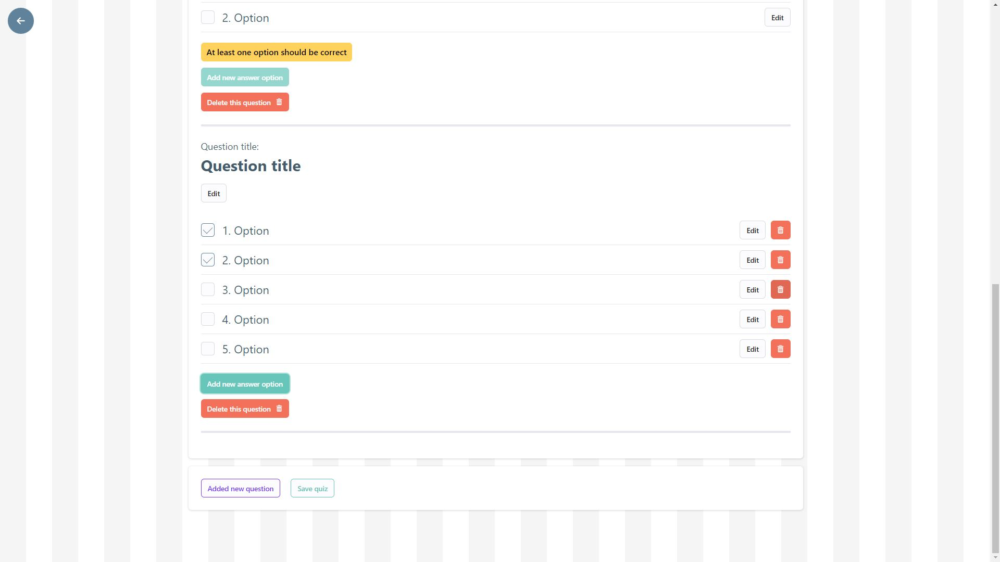
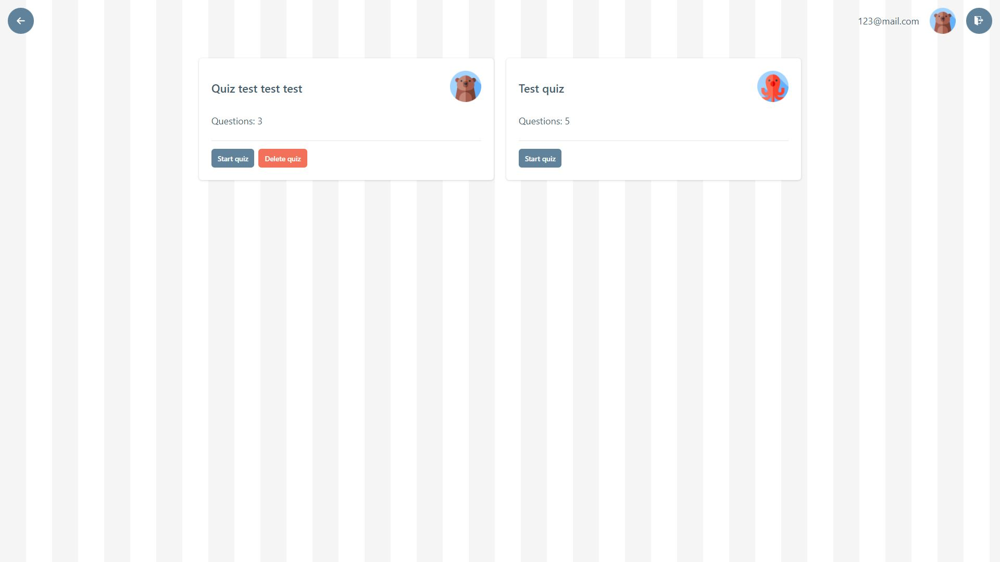
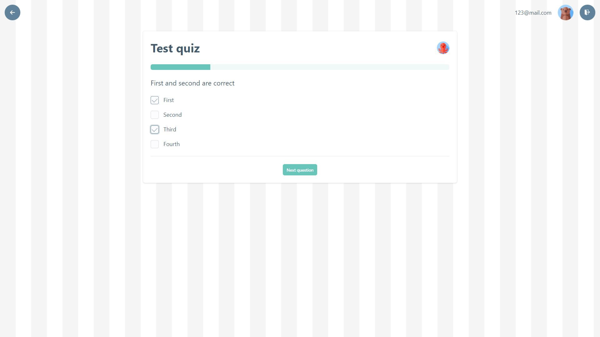
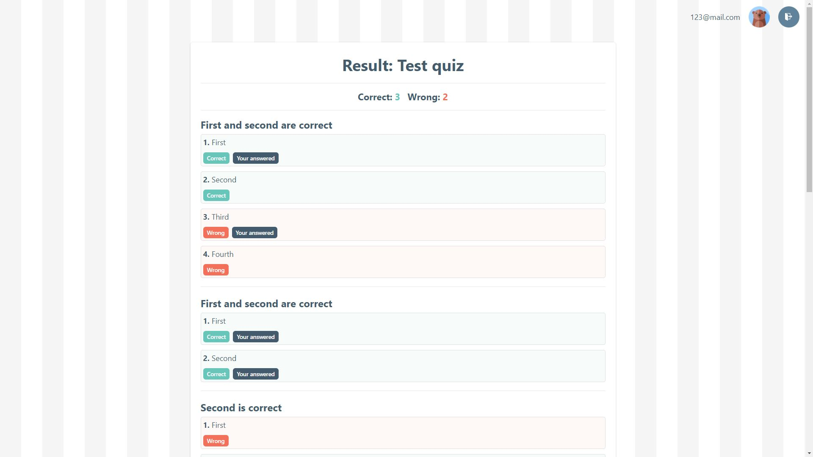
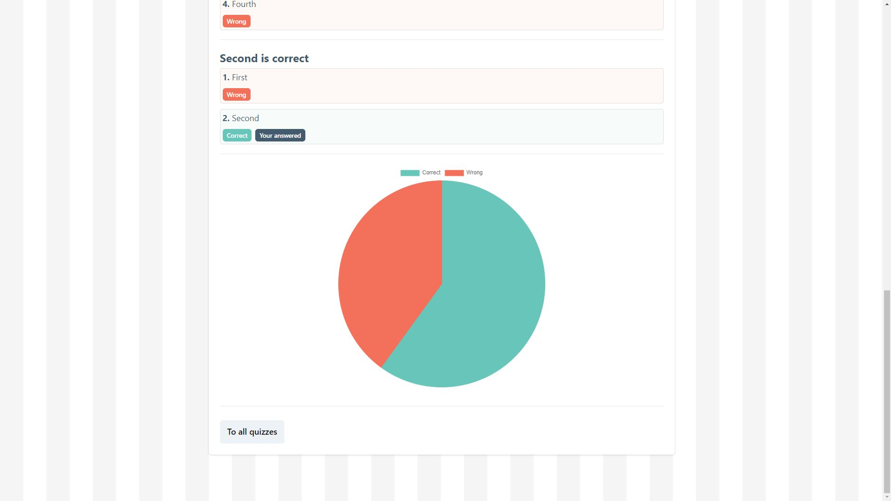

### Quiz Creator - Front-End Part.

**Tools**: TS, ReactJS, Zustand, Immer, React-Router-Dom, React-Icons, Bumbag, React-Chartjs-2, Framer-Motion, UniqId, Axios, JWT-Decode.

### Features:

- Create profile;
- Create new quiz with various questions;
- Delete own quiz;
- Try users' quizzes;
- Get detailed result at the end of the quiz;

**Start page**

**Authentication page**

**Sign in form page**

**Sign up form page**

**Quiz creator page**

**Quiz creator page**

**All quizzes page**

**Quiz page**

**Quiz result page**

**Quiz result page**

To install und run the project:

### `1. npm install`

### `2. npm start`

(Please check the back-end part: [https://github.com/VolodymyrVoronov/quiz-creator-back](https://github.com/VolodymyrVoronov/quiz-creator-back))

_DISCLAIMER:_
Please note, this project is for demonstration purpose only.
